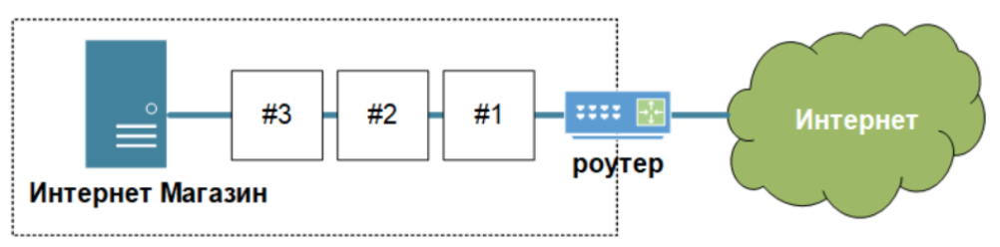
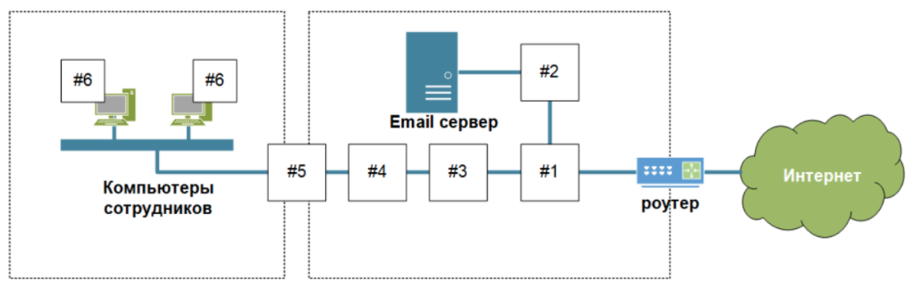

# Ритейл

1. Необходимо установить МСЭ. МСЭ необходим для изоляции локальной сети от внешней. Так как внутренняя должна быть безопасной и защищена от вредоносов, вирусов и злоумышленников. Для защиты сетей от нежелательного трафика и несанкционированного доступа можно применить многофункциональную систему защиты "Cisco ASA 5500 Series".

1. Для определения и подавления DDoS можно использователь разные подходы (Блокировать бот трафик можно через провайдера используя технолигию BGP, так же можно использовать сторонние сервисы на примере Group-IB). Для выявления и блокирования бот-активности можно использовать продукт от Group-IB "Fraud Hunting Platform", модуль "Preventive Proxy".

1. Для выявления и блокирования современных атак на веб-приложения необходимо использовать WAF. Основное предназначение WAF - защита приложений от несанкционированного доступа, даже при наличии критичных уязвимостей. Для защиты Web приложений можно использовать "Nemesida WAF"

# Промышленность

1. Так же необходимо установить МСЭ. МСЭ необходим для изоляции локальной сети от внешней. Так как внутренняя должна быть безопасной и защищена от вредоносов, вирусов и злоумышленников. Для защиты сетей от нежелательного трафика и несанкционированного доступа можно применить многофункциональную систему защиты "Cisco ASA 5500 Series".

1. Для защиты электронной почты от вирусов и спама, необходим почтовый антивирус. Данное решение есть у "Касперсокого", их продукт "Kaspersky Endpoint Security" - это почтовый антивирус. Он проверяет все входящие и исходящие письма на наличие в них вирусов и других программ, представляющих угрозу.

1. Необходима защита как от известных и еще не изученных угроз, защита от того, что может пропустить антивирус. Уменьшить риск реализации угрозы сможет решение от компании "Malwarebytes", а точнее их продукт "Malwarebytes Endpoint Protection"

1. Для выявления и блокирования современных атак на веб-приложения необходимо использовать WAF. Основное предназначение WAF - защита приложений от несанкционированного доступа, даже при наличии критичных уязвимостей. Для защиты Web приложений можно использовать "Nemesida WAF"

1. Для разграничения доступа между корпоративной сетью и DMZ необходимо так же установить МСЭ только уже другого вендора. Например МСЭ UserGate X1 предназначенный именно для решения задач по безопасности в промышленном производстве.

1. Антивирусное ПО, например "Лабаратория Касперсого". Позволит защитить рабочую станцию от, известных вендору, вредоносов и вредоносного ПО.